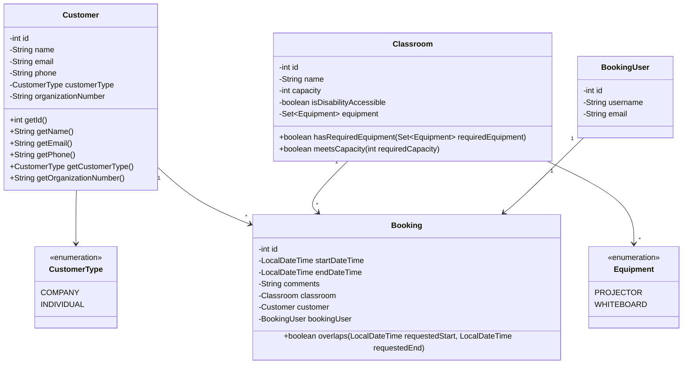

# Project Structure

## UML Diagram

```mermaid
classDiagram

    class Customer {
        -int id
        -String name
        -String email
        -String phone
        -CustomerType customerType
        -String organizationNumber
        +int getId()
        +String getName()
        +String getEmail()
        +String getPhone()
        +CustomerType getCustomerType()
        +String getOrganizationNumber()
    }

    class CustomerType {
        <<enumeration>>
        COMPANY
        INDIVIDUAL
    }

    class Classroom {
        -int id
        -String name
        -int capacity
        -boolean isDisabilityAccessible
        -Set~Equipment~ equipment
        +boolean hasRequiredEquipment(Set~Equipment~ requiredEquipment)
        +boolean meetsCapacity(int requiredCapacity)
    }

    class Equipment {
        <<enumeration>>
        PROJECTOR
        WHITEBOARD
    }

    class BookingUser {
        -int id
        -String username
        -String email
    }

    class Booking {
        -int id
        -LocalDateTime startDateTime
        -LocalDateTime endDateTime
        -String comments
        -Classroom classroom
        -Customer customer
        -BookingUser bookingUser
        +boolean overlaps(LocalDateTime requestedStart, LocalDateTime requestedEnd)
    }

    Customer --> CustomerType
    Classroom "1" --> "*" Equipment
    Customer "1" --> "*" Booking
    Classroom "1" --> "*" Booking
    BookingUser "1" --> "*" Booking

```