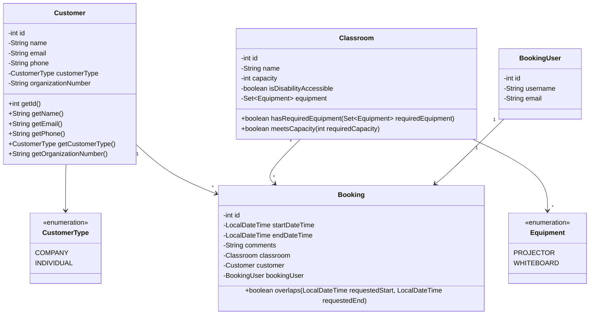

# Project Structure

## UML Diagram

* A Customer can have many Bookings.
* A Classroom can have many Bookings, but not at overlapping times.
* A BookingUser creates bookings.
* A Booking belongs to one customer, one classroom, and one booking user.
* A classroom can contain multiple pieces of equipment.
* A customer can either be a CompanyCustomer or an IndividualCustomer.