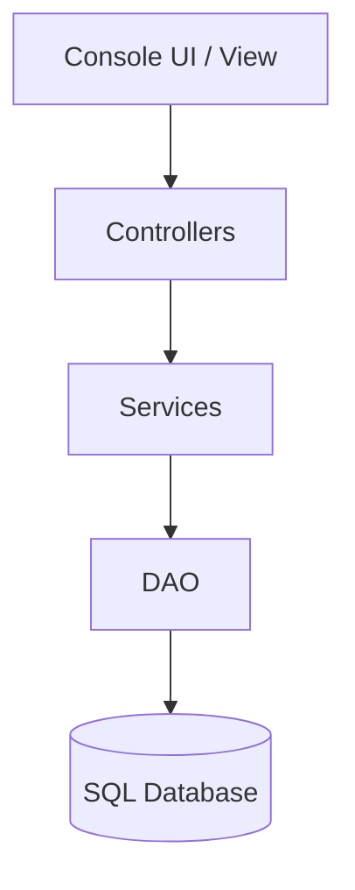
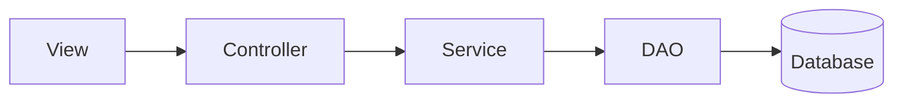

# Architecture

## Purpose

This document describes the overall software architecture of the Classroom Rental App.

The project follows the Model-View-Controller (MVC) architectural pattern together with a Service layer and Data Access Objects (DAO) to achieve a clear separation of responsibilities.

---

## Architectural Overview

The application is structured into five layers.



Each layer has a clearly defined responsibility.
---

## Model

The model represents the business domain.

Responsibilities:

- Store application state.
- Represent business entities.
- Contain domain-specific behavior.

Examples:

- Customer
- BookingUser
- Classroom
- Booking

The model should not perform console input/output or database operations.

### Model Usage Across Layers

The domain model is shared across the application.

Model objects may be used as parameters, return values, or data representations by the View, Controller, Service, and DAO layers.

Examples include:

- A `Booking` returned from `BookingDao`.
- A `Classroom` passed from `BookingService` to `BookingController`.
- A `Customer` displayed by the View.

The Model itself must remain independent.

Domain classes must not:

- perform console input or output
- execute SQL
- access DAO classes
- access Controller classes
- access View classes

This keeps the domain model reusable and independent from the application's technical infrastructure.

---

## View

The View represents the console user interface.

Responsibilities:

- Display menus.
- Read user input.
- Display results.
- Display error messages.

The View should never communicate directly with the database.

---

## Controller

Controllers coordinate user actions.

Responsibilities:

- Receive requests from the View.
- Validate simple user input.
- Delegate business operations to the Service layer.
- Return results to the View.

Controllers should contain minimal business logic.

---

## Service Layer

The Service layer contains the application's business logic.

Responsibilities:

- Validate booking rules.
- Search available classrooms.
- Coordinate multiple DAO operations.
- Apply business rules.

Examples:

- BookingService
- CustomerService
- ClassroomService

---

## DAO Layer

The DAO layer is responsible for persistence.

Responsibilities:

- Execute SQL queries.
- Map database records to Java objects.
- Perform CRUD operations.

Each entity should have its own DAO implementation.

Examples:

- CustomerDao
- BookingDao
- ClassroomDao
- BookingUserDao

The DAO layer should contain no business logic.

---

## Database

Persistent data is stored in a relational SQL database using JDBC.

All communication with the database passes through the DAO layer.

---

## Package Structure

```text
src/main/java/se/lexicon/
├── model/
├── dao/
├── service/
├── controller/
├── view/
├── exception/
└── Main.java
```

## Package Responsibilities

### `se.lexicon.model`

Contains the domain model.

Examples:

- `Customer`
- `BookingUser`
- `Classroom`
- `Booking`
- `Equipment`

Responsibilities:

- Represent domain data.
- Contain behavior that belongs naturally to the domain object.
- Remain independent from UI and persistence concerns.

Example domain behavior:

- Checking whether two booking time ranges overlap.
- Checking whether a classroom meets a capacity requirement.
- Checking whether a classroom contains required equipment.

---

### `se.lexicon.dao`

Contains Data Access Objects responsible for persistence.

Examples:

- `CustomerDao`
- `BookingUserDao`
- `ClassroomDao`
- `BookingDao`

Responsibilities:

- Execute SQL through JDBC.
- Insert, update, delete, and retrieve persistent data.
- Map database records to domain objects.
- Handle database-specific operations.

DAO classes must not contain application business rules.

---

### `se.lexicon.service`

Contains application business logic.

Examples:

- `CustomerService`
- `ClassroomService`
- `BookingService`

Responsibilities:

- Apply business rules.
- Validate operations.
- Coordinate multiple DAO calls.
- Perform searches and filtering where appropriate.

Examples:

- Find classrooms matching booking requirements.
- Prevent overlapping classroom bookings.
- Validate booking date and time ranges.

---

### `se.lexicon.controller`

Coordinates interaction between the View and Service layers.

Examples:

- `CustomerController`
- `BookingController`
- `ClassroomController`

Responsibilities:

- Receive requests from the View.
- Delegate operations to services.
- Return results to the View.
- Coordinate application use cases.

Controllers should contain little or no business logic.

---

### `se.lexicon.view`

Contains the console user interface.

Responsibilities:

- Display menus.
- Read user input.
- Display application data.
- Display user-friendly error messages.

The View must not execute SQL or communicate directly with DAO classes.

---

### `se.lexicon.exception`

Contains application-specific exceptions.

Possible examples:

- `InvalidBookingException`
- `BookingConflictException`
- `DataAccessException`

Exceptions should communicate meaningful failure conditions between layers.

---

## Dependency Rules

The application follows a layered architecture.

Business operations should normally follow this flow:



Each layer should delegate responsibilities to the appropriate lower layer rather than bypassing the architecture.

The following interactions should be avoided:

- View communicating directly with DAO classes.
- View executing SQL or accessing the database directly.
- Controller executing SQL.
- DAO containing business rules.
- DAO communicating with the View.
- Business logic being implemented in the View.
- Domain model classes depending on View, Controller, Service, or DAO classes.

The domain model may be used by the other layers as application data, but the model itself should remain independent.

---

## Exception Handling

Exceptions should be propagated upward until they can be handled appropriately.

Responsibilities:

- DAO throws persistence exceptions.
- Services throw business exceptions.
- Controllers decide how to react.
- Views present user-friendly messages.

---

## Future Extensions

The architecture allows future additions such as:

- Authentication
- Role management
- GUI implementation
- REST API
- Additional database implementations

without major changes to the domain model.